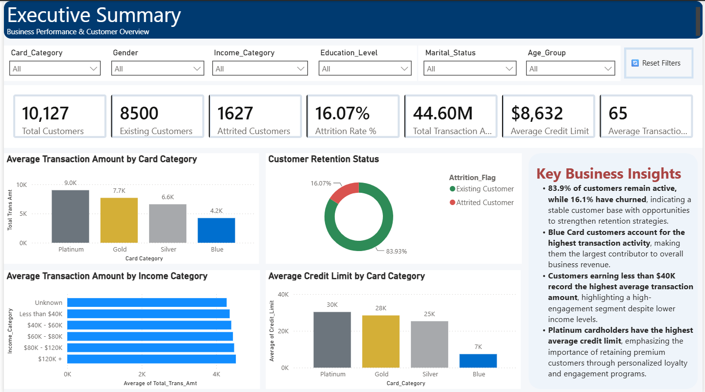
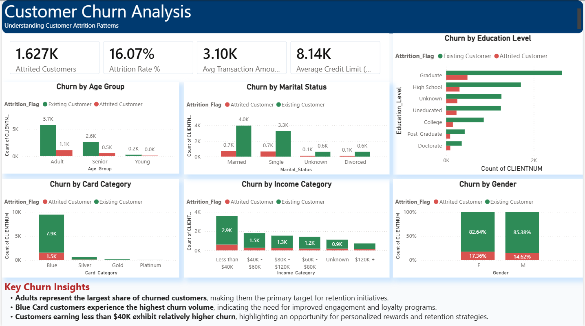
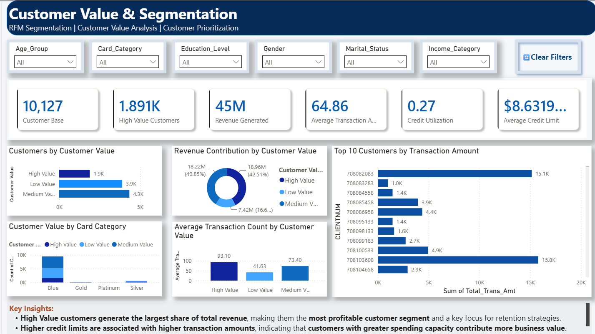

# 💳 Customer Churn Analytics & Retention Strategy

<p align="center">


### Banking & Financial Services | End-to-End Data Analytics Project

An end-to-end analytics project analyzing **10,127 banking customers** to identify churn patterns, understand customer value, and develop targeted retention strategies using **SQL, Python, Power BI, DAX, and Excel**.

---
## Table of Contents

- [Dashboard Preview](#dashboard-preview)
- [Project Snapshot](#project-snapshot)
- [Business Problem](#business-problem)
- [Business Objectives](#business-objectives)
- [Key Business Questions](#key-business-questions)
- [Dataset](#dataset)
- [Analytics Workflow](#analytics-workflow)
- [SQL Analytics](#sql-analytics)
- [Python Analytics](#python-analytics)
- [Power BI Dashboard](#power-bi-dashboard)
- [Dashboard Design](#dashboard-design)
- [DAX Measures](#dax-measures)
- [Key Insights](#key-insights)
- [Business Recommendations](#business-recommendations)
- [Technology Stack](#technology-stack)
- [Repository Structure](#repository-structure)
- [Getting Started](#getting-started)
- [Skills Demonstrated](#skills-demonstrated)
- [Author](#author)
- [Project Focus](#project-focus)

## Dashboard Preview

<p align="center">
  
</p>

<p align="center">
  
</p>

<p align="center">
  
</p>

<p align="center">
  <b>Interactive 3-page Power BI dashboard covering executive KPIs, customer churn analysis, and customer value segmentation.</b>
</p>

---

## Project Snapshot

| Metric             | Details                                        |
| ------------------ | ---------------------------------------------- |
| Domain             | Banking & Financial Services                   |
| Customers Analyzed | 10,127                                         |
| Churn Rate         | 16.1%                                          |
| Dashboard Pages    | 3                                              |
| Primary Tools      | SQL, Python, Power BI                          |
| Supporting Tools   | DAX, Excel                                     |
| Analysis Focus     | Churn, Customer Value, Segmentation, Retention |

---

## Business Problem

Customer attrition directly affects revenue, customer lifetime value, and customer acquisition costs in the banking and financial services industry.

The objective of this project is to understand **why customers churn, which customer segments are most valuable, and where the business should focus its retention efforts.**

### Central Business Question

> **How can the bank identify high-risk and high-value customers and develop targeted retention strategies based on customer behavior?**

---

## Business Objectives

The project aims to:

* Analyze overall customer churn and identify major churn patterns.
* Identify customer segments with higher attrition risk.
* Analyze spending, transaction, credit limit, and utilization behavior.
* Identify high-value customers requiring stronger retention efforts.
* Build an interactive dashboard for monitoring customer and churn KPIs.
* Translate analytical findings into actionable business recommendations.

---

## Key Business Questions

### Customer Churn

* What percentage of customers have churned?
* Which card categories have the highest churn?
* How does churn vary across income categories?
* Which age groups show higher attrition?
* How does churn differ across demographic segments?

### Customer Value

* Which customers generate the highest value?
* How does spending differ across customer segments?
* Which segments have higher transaction amounts?
* Which segments have higher credit limits?

### Retention

* Which customer segments should be prioritized for retention?
* What customer behaviors may indicate increased churn risk?
* How can retention campaigns be targeted based on customer value and behavior?

---

## Dataset

The project uses the **Bank Customer Churn Prediction** dataset containing customer demographic, financial, and behavioral information.

| Attribute       | Details                        |
| --------------- | ------------------------------ |
| Dataset         | Bank Customer Churn Prediction |
| Records         | 10,127                         |
| Features        | 23                             |
| Domain          | Banking & Financial Services   |
| Target Variable | `Attrition_Flag`               |

### Data Source

Original dataset:

[Bank Customer Churn Prediction — Kaggle](https://www.kaggle.com/datasets/bhuviranga/customer-churn-data?select=Bank+Customer+Churn+Prediction.csv)

### Data Preparation

The dataset was prepared for analysis by:

* Removing unnecessary columns
* Handling and validating analytical fields
* Creating Age Group categories
* Creating Customer Value segments
* Creating Customer Status labels
* Creating Utilization Categories
* Preparing the dataset for SQL, Python, and Power BI analysis

The cleaned dataset is available in:

```text
Dataset/BankChurners_Cleaned.csv
```

---

## Analytics Workflow

```text
Business Understanding
        ↓
Data Cleaning & Preparation
        ↓
SQL Business Analysis
        ↓
Python Exploratory Data Analysis
        ↓
Customer Segmentation
        ↓
Power BI Dashboard
        ↓
Business Insights
        ↓
Retention Recommendations
```

The analysis follows a consistent business-analysis framework:

```text
Business Question
        ↓
Analysis
        ↓
Insight
        ↓
Recommendation
```

---

## SQL Analytics

SQL was used to perform customer-level analysis and answer the project's core business questions.

### Analysis Areas

* Customer churn analysis
* Customer inactivity analysis
* Spending behavior
* Revenue analysis
* Customer engagement
* Customer segmentation
* Customer value analysis
* KPI calculations

### SQL Concepts Used

* Aggregate Functions
* `CASE` Statements
* Subqueries
* Common Table Expressions (CTEs)
* Window Functions
* Ranking Functions
* Conditional Aggregation
* Grouping and Filtering

SQL analysis was performed using **MySQL**.

---

## Python Analytics

Python was used for exploratory data analysis, customer segmentation, and visualization.

### Libraries

* Pandas
* NumPy
* Matplotlib

### Analysis Performed

* Data validation and cleaning
* Exploratory Data Analysis
* Customer demographic analysis
* Churn analysis
* Spending analysis
* Correlation analysis
* Customer segmentation
* Customer value analysis

### Key Visualizations

* Customer Age Distribution
* Gender Distribution
* Card Category Distribution
* Churn Analysis
* Revenue Analysis
* Customer Value Distribution
* Correlation Heatmap

---

## Power BI Dashboard

The Power BI dashboard contains **three analytical pages**, each designed around a specific business objective.

### Page 1 — Executive Summary

Provides a high-level view of customer health and overall business performance.

#### Key KPIs

* Total Customers
* Attrition Rate
* Average Transaction Amount
* Average Credit Limit
* Average Utilization Ratio

#### Key Visuals

* Customer Status Distribution
* Revenue by Card Category
* Transaction Amount by Income Category
* Average Credit Limit by Card Category
* Business Insights Summary

---

### Page 2 — Customer Churn Analysis

Focuses on identifying where customer attrition is concentrated.

#### Analysis

* Churn by Card Category
* Churn by Income Category
* Churn by Age Group
* Churn by Gender
* Churn by Education Level
* Churn by Marital Status

This page helps identify customer groups that may require additional retention attention.

---

### Page 3 — Customer Value & Segmentation

Focuses on identifying high-value customers and understanding the contribution of different customer segments.

#### Analysis

* Customer Value Distribution
* Revenue by Customer Segment
* Average Transaction Amount
* Average Credit Limit
* Customer Segmentation

This page supports prioritization of retention efforts based on customer value.

---

## Dashboard Design

The dashboard was designed with a focus on:

* Executive-level KPI visibility
* Clear visual hierarchy
* Consistent formatting
* Interactive filtering
* Segment-level analysis
* Business-oriented storytelling

### Available Filters

* Card Category
* Gender
* Income Category
* Age Group

The dashboard allows users to move from:

**Overall Performance → Churn Patterns → Customer Value**

---

## DAX Measures

Key DAX measures used in the Power BI dashboard include:

```text
Total Customers
Attrition Rate
Total Revenue
Average Transaction Amount
Average Credit Limit
Average Utilization Ratio
High Value Customers
```

These measures allow KPIs and visualizations to update dynamically based on dashboard filters.

---

## Key Insights

### Customer Attrition

**16.1% of customers have churned**, while 83.9% remain active.

This indicates a meaningful customer retention opportunity for the business.

### Card Category

Blue Card customers account for the largest share of churned customers, making this segment an important target for retention initiatives.

### Income

Customers earning below **$40K** show relatively higher churn, suggesting that income level may influence customer retention behavior.

### Customer Demographics

Adults account for the highest number of churned customers, making this segment important for deeper behavioral analysis.

### Customer Value

High-value customers generate a significant share of overall revenue and therefore represent a priority segment for proactive retention.

### Credit Limit

Platinum cardholders have the highest average credit limit, highlighting differences in customer value across card categories.

---

## Business Recommendations

Based on the analysis, the following strategies are recommended.

### 1. Prioritize High-Value Customers

Develop personalized retention campaigns for customers with higher transaction activity and revenue contribution.

### 2. Build an Early-Warning System

Monitor declining transaction activity, utilization changes, and inactivity to identify customers who may be at higher risk of churn.

### 3. Improve Blue Card Engagement

Introduce targeted loyalty benefits, personalized offers, and engagement campaigns for Blue Card customers.

### 4. Personalize Customer Offers

Use customer value, spending behavior, income, and product usage to create more relevant rewards and offers.

### 5. Monitor Retention KPIs

Use the Power BI dashboard to continuously track churn, customer value, transaction behavior, and segment performance.

---

## Technology Stack

| Category              | Tools                 |
| --------------------- | --------------------- |
| Data Analysis         | Python, Pandas, NumPy |
| Data Visualization    | Matplotlib, Power BI  |
| Database              | MySQL                 |
| Business Intelligence | Power BI, DAX         |
| Data Preparation      | Excel, Python         |
| Version Control       | Git, GitHub           |

---

## Repository Structure

```text
## Repository Structure

```text
Customer-Lifetime-Value-Retention-Strategy/
│
├── Images/
│   ├── executive_summary_dashboard.png
│   ├── customer_churn_analysis.png
│   └── customer_value_segmentation.png
│
├── Dataset/
│
├── SQL/
│
├── Python/
│
├── Power BI/
│
├── Documentation/
│
├── README.md
└── requirements.txt
```

---

## Getting Started

### Clone the Repository

```bash
git clone https://github.com/Himanshu6203/Customer-Lifetime-Value-Retention-Strategy.git

cd Customer-Lifetime-Value-Retention-Strategy
```

### Install Python Dependencies

```bash
pip install -r requirements.txt
```

### Run the Analysis

#### SQL

Import the cleaned dataset into MySQL and execute the SQL queries from the `SQL` folder.

#### Python

Open the Jupyter Notebook located in the `Python` folder and run the analysis.

#### Power BI

Open the `.pbix` dashboard file using Power BI Desktop.

---

## Future Improvements

Potential extensions include:

* Machine Learning-based churn prediction
* Customer Lifetime Value prediction
* Customer-level churn probability scoring
* Automated Power BI data refresh
* Real-time retention monitoring
* What-If analysis for retention strategies

---

## Skills Demonstrated

### Data Analytics

SQL · Python · Pandas · NumPy · Excel

### Business Intelligence

Power BI · DAX · KPI Development · Dashboard Design

### Business Analysis

Business Problem Definition · Customer Segmentation · Churn Analysis · Customer Value Analysis · Retention Strategy

### Data Storytelling

Exploratory Analysis · Visualization · Insight Generation · Business Recommendations

---

## Project Focus

**Customer Analytics · Churn Analysis · Customer Segmentation · Retention Strategy · Business Intelligence**

---

If you found this project useful, consider giving the repository a star.


